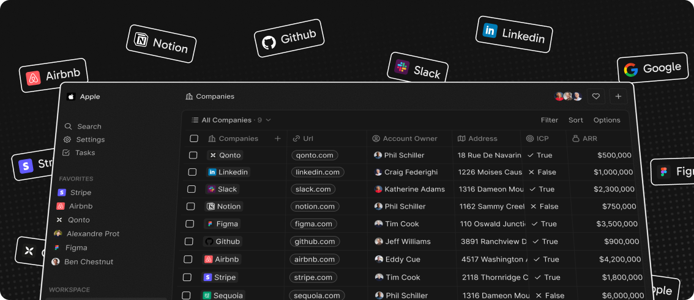

# Twenty CI/CD pipeline

Deploy Twenty server with CI/CD on Elestio

 
 

# Once deployed ...

You can open Twenty UI here:

    URL: https://[CI_CD_DOMAIN]
    login: "[ADMIN_EMAIL]"
    password: "[ADMIN_PASSWORD]"

You can open pgAdmin here:

    URL: https://[CI_CD_DOMAIN]:63405
    login: "[ADMIN_EMAIL]"
    password: "[ADMIN_PASSWORD]"

# Sign up

By default, registrations are disabled for new users. However, you can easily enable them by following these simple steps:

1. Access Elestio Dashboard: Log in to your Elestio account and navigate to your dashboard.

2. Update Configurations: Once in your dashboard, locate and click on the `Update Config` button.

3. Modify Settings: Within the configuration settings, find the parameter labeled `IS_SIGN_UP_DISABLED`. By default, it is set to "true".

4. Enable Registrations: Change the value of `IS_SIGN_UP_DISABLED` from `true` to `false`.

5. Save Changes: After making the necessary modifications, ensure to save your changes by clicking on the `Update & restart` button.
